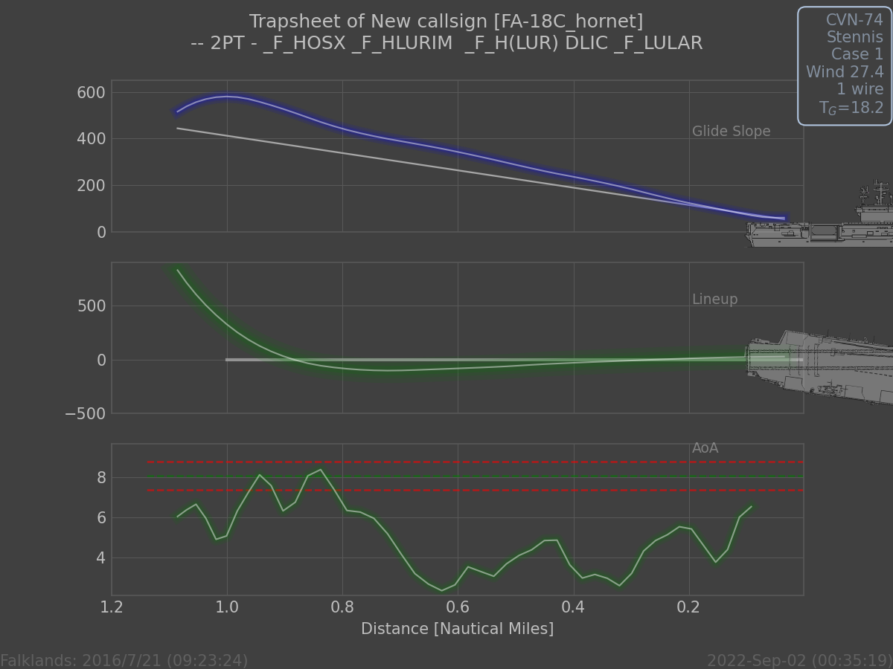
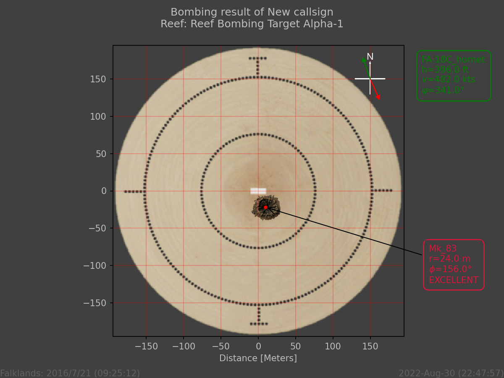
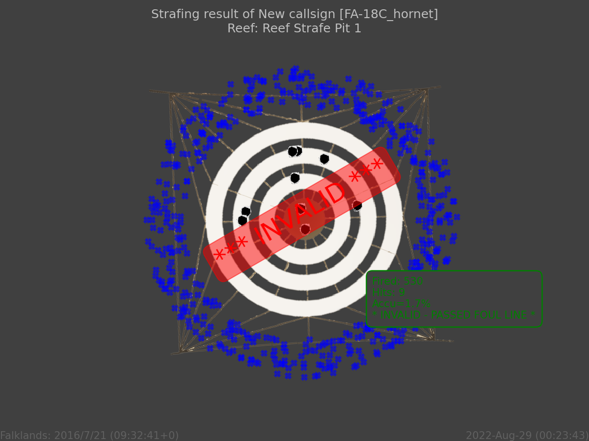

# FunkMan
 FunkMan is a python program that creates an easy-to-use interface between the DCS scripting environment and a Discord bot via a UDP socket connection.
 This allows you, *e.g.*, to send text messages from DCS to Discord channels.
 
 Furthermore, FunkMan contains special interfaces to the [MOOSE](https://github.com/FlightControl-Master/MOOSE) classes [AIRBOSS](https://flightcontrol-master.github.io/MOOSE_DOCS_DEVELOP/Documentation/Ops.Airboss.html) and [RANGE](https://flightcontrol-master.github.io/MOOSE_DOCS_DEVELOP/Documentation/Functional.Range.html). For the AIRBOSS class, you get embeded messages when a player receives an LSO
 grade and fancy images of the trap sheet. For the RANGE class, images of the bombing impact point are send to Discord as well as as summary of a strafing run.

Note that this program is based on the [HypeMan](https://github.com/madmoney99/HypeMan-Legacy) code and credit goes to the original author.

## Prerequisite
Before you install FunkMan you need to know which other software is required for FunkMan to work. As FunkMan is a python program, it obviously needs python installed and some common libraries.

### Python
You can get python from [python.org](https://www.python.org/). During the installation, you should also install `pip` when asked and add the install directory to the windows `PATH` environment variable.

The additional libraries can be installed with pip. These are:
- [discord.py](https://discordpy.readthedocs.io/en/stable/): `pip install discord`
- [matplotlib](https://matplotlib.org/): `pip install matplotlib`
- [numpy](https://numpy.org/): `pip install numpy`

### MOOSE
Download the `Moose.lua` file from the MOOSE [develop branch](https://github.com/FlightControl-Master/MOOSE_INCLUDE/tree/develop/Moose_Include_Static).

Then load it in your mission via the triggers section in the mission editor:


Also read the [MOOSE docs](https://flightcontrol-master.github.io/MOOSE/) and join the [MOOSE discord](https://discord.gg/gj68fm969S).

### Discord Bot
Finally, you need to create a discord bot. There are plenty of youtube videos around, which explain how to do this.
Go to the http://discord.com/developers site to create a bot.

#### Common Errors
If you get `discord.errors.Forbidden: 403 Forbidden (error code: 50001): Missing Access` check that the bot has sufficient permissions.

## Installation
There are several ways to obtain the FunkMan code. You can use `git clone` if you are familiar with git
or download the [latest release](https://github.com/funkyfranky/FunkMan/releases) as zip file and unzip
it to a location of your liking, e.g. `D:\FunkMan\`.

The FunkMan directory contains three important files:
- `FunkMan.ini`: This is the config file, where you specify important parameters of your bot and socket connection.
- `FunkMan.py`: This is the file that contains the few lines of python code needed to start FunkMan. Usually, no need to change this.
- `FunkMan.bat`: This is the file you can click to start FunkMan by running the above python file.

So after downloading the FunkMan code, you first need to adjust the `FunkMan.ini` file. The important parameters
are the Token of your Discord bot and the ID of Discord channel(s), where FunkMan will send messages and images to.

### Docker Container
Another way to install funkman is via a Docker container. You first need to download and install the docker desktop app.

Then you pull the funkman image from docker hub via the command line 
```docker pull funkyfranky/funkman:v0.7```

The you can create and run an image via
```
docker run -p 10042:10042/udp -e FUNKMAN_DISCORD_TOKEN=INSERT_YOUR_TOKEN -e FUNKMAN_CHANNELID_MAIN=1011372894162526329 -e FUNKMAN_CHANNELID_RANGE=1006216842509041786 -e FUNKMAN_CHANNELID_AIRBOSS=1011372920968323155 funkyfranky/funkman:v0.7
```
Note here the discord token as well as the discord channel IDs have to be provided as an environment variable (`-e`parameters). The `FUNKMAN_CHANNELID_RANGE` and `FUNKMAN_CHANNELID_AIRBOSS` are optional.

## Config File
The config file consists of multiple sections, each starting with square brackets.

### [DEFAULT]
This sections contains a parameter for debugging:
- `DEBUGLEVEL`: Higher numbers lead to more output. Default is 0.

### [FUNKBOT]
This section contains information about the Discord bot parmeters:
- `TOKEN`: Is the secret (!) token of the bot.
- `CHANNELID_MAIN`: The main channel ID used for all messages by default.
- `CHANNELID_RANGE`: (Optional) Channel ID where RANGE messages are send to.
- `CHANNELID_AIRBOSS`: (Optional) Channel ID where AIRBOSS messages are send to.
The parameters `CHANNELID_RANGE` and `CHANNELID_AIRBOSS` are optional and allow you to send the information coming from AIRBOSS and RANGE to separate channles.

### [FUNKSOCK]
This section contains information about the UDP socket:
- `PORT`: UDP Port. Default is 10042.
- `HOST`: Host name. Default is 127.0.0.1.

### [FUNKPLOT]
This section contains information for plotting images.
- `IMAGEPATH`: Directory where the necessary images are stored. Default is `./funkpics/`.
By default, the image directory is supposed to be in the same directory as main `FunkMan` files.

### Example
```
[DEFAULT]
DEBUGLEVEL=0

[FUNKBOT]
TOKEN=MTAwNTAwMDA0NDc4MjU2MzQ0MQ.GmUqVd.cMRDGb6JxFMpN3cAAU-DX2Z4SymgTJLAwL-C8I
CHANNELID_MAIN=1011372894162526329
CHANNELID_RANGE=1006216842509041786
CHANNELID_AIRBOSS=1011372920968323155

[FUNKSOCK]
PORT=10042
HOST=127.0.0.1

[FUNKPLOT]
IMAGEPATH=./funkpics/
```

## Usage
Once you have configured FunkMan with the ini file, FunkMan is started by simply clicking the `FunkMan.bat` file.
If everything is setup correctly, you will obtain the following output telling you that you bot has connected:

```
Hello, my name is FunkMan. I'm at your service!
Reading config file ./FunkMan.ini
Init FunkPlot: Reading images from ./funkpics/...
FunkSocket: Host=127.0.0.1:10042
Starting threaded discord bot!
Starting Bot Client with Token MTAwN...
Starting Socket server 127.0.0.1:10042
2022-09-04 15:15:32 INFO discord.client logging in using static token
2022-09-04 15:15:32 INFO discord.gateway Shard ID None has connected to Gateway (Session ID: a5c59cb119409c066f008a4a1dbc4bca).
Connected as FunkBot [ID: 1005000044782563441]
```

### DCS Setup
For the following scripts to work, you have to "de-sanitize" some parts of the `MissionScripting.lua`, which is located in the `{DCS_INSTALLATION}/Scripts/` folder.
The file should look like this:
```lua
do
	--sanitizeModule('os')
	--sanitizeModule('io')
	--sanitizeModule('lfs')
	--_G['require'] = nil
	_G['loadlib'] = nil
	--_G['package'] = nil
end
```
**Note** that you have to repeat this step after each DCS update (or repair) as DCS will restore the sanitized version of the file.

### Text Messages
Sending simple text messages from the DCS scripting environment is pretty easy.
In your lua script you need to create a new [SOCKET](https://flightcontrol-master.github.io/MOOSE_DOCS_DEVELOP/Documentation/Utilities.Socket.html) object:
```
mySocket=SOCKET:New()
mySocket:SendText("Red Helicopter in Southern Zone!")
```
This works as long as you use the default port, which is `10042`. If you changed that port in the `FunkMan.ini` file,
you need to pass that as parameter in the [:New](https://flightcontrol-master.github.io/MOOSE_DOCS_DEVELOP/Documentation/Utilities.Socket.html##(SOCKET).New) function, *e.g.* `mySocket=SOCKET:New(10081)`.

### Airboss
Sending LSO grades and trapsheets from the [AIRBOSS](https://flightcontrol-master.github.io/MOOSE_DOCS_DEVELOP/Documentation/Ops.Airboss.html) class is as simple as adding the command
`myAirboss:SetFunkManOn()`.

So for example:
```lua
local myAirboss=AIRBOSS:New("USS Stennis", "Stennis")
myAirboss:SetFunkManOn()
-- More Config stuff here...
myAirboss:Start()
```

Note that the default port `10042` is used here. If you want to change it, you have to pass it as parameter to the [SetFunkManOn](https://flightcontrol-master.github.io/MOOSE_DOCS_DEVELOP/Documentation/Ops.Airboss.html##(AIRBOSS).SetFunkManOn) function.

#### Trapsheet Example


In the picture you can see that player "New Callsign" trapped in an F/A-18C Hornet and got an LSO grade `--` (2 Points).

**Blue box:** The carrier name was CVN-74 and it was the USS Stennis. It was a Case 1 recovery. The wind on deck was 27.4 knots. The player caught wire 1 and was 18.2 seconds in the groove.

**Upper image:** This displays the glide slope as a function of the distance to the boat. The blue line is the players result and the grey line shows the optimal glide slope. The y-axis is in feet.

**Middle image:** This part shows the line up in a top-to-bottom view. The green line shows the players actual position and the grey line shows the center line. The y-axis is in feet.

**Lower image:** Here the angle-of-attack (AoA) is shown. The dashed green line shows the optimal AoA and the red dashed lines show the accaptable min/max AoA values. The player's AoA is shown as solid green line.

### Range
Sending bombing and strafing results from the [RANGE](https://flightcontrol-master.github.io/MOOSE_DOCS_DEVELOP/Documentation/Functional.Range.html) class is done by adding the command
`myRange:SetFunkManOn()`.

So for example:
```lua
local myRange=RANGE:New("Goldwater Range")
myRange:SetFunkManOn()
-- More Config stuff here...
myRange:Start()
```

Note that the default port `10042` is used here. If you want to change it, you have to pass it as parameter to the [SetFunkManOn](https://flightcontrol-master.github.io/MOOSE_DOCS_DEVELOP/Documentation/Functional.Range.html##(RANGE).SetFunkManOn) function.

#### Bombing Result Example


In the picture you can see that player "New Callsign" dropped a Mk 83 bomb at the range named "Reef". The target name was "Reef Bombing Target Alpha-1".

**Red box:** The distance to the target was `r=24` meters at an angle of `phi=159°`. The red arrow also displays the heading in the North Up figure.

**Green box:** The player used an F/A-18C Hornet and dropped the bomb at an altitude of `h=396 ft` and a speed of `v=482 kts` flying heading `psi=341°`. The heading is also depicted as a green arrow in the North Up figure. From the red and green arrows, you can derive whether the bomb impacted long, short, left or right.

Furthermore, you get information about the map, mission time/date and actual time and date of the bombing run.

#### Strafing Result Example


In the picture you can see that player "New Callsign" performed a strafing run at range "Reef" on target "Reef Strafe Pit 1" in an F/A-18C Hornet.

**Green Box:** The player fired 530 rounds during the run and hit 9 times. This gives an accuracy of 1.7%. This pass was invalid, because he still fired after passing the fould line.

The rounds that hit are displayed as bullet holes in the center area of the target image. The rounds that did not hit are dipicted as blue crosses in the outer ring area.

## Subpackages
As a side note, FunkMan contains three subpackages:
- `FunkSock`: A socket server that handles data received via an UDP connection
- `FunkBot`: An interface to Discord bots using discord.py.
- `FunkPlot`: Contains a class to make pretty figures for the `MOOSE` `RANGE` and `AIRBOSS`classes using matplotlib.
You can use each of these subpackges on its own or in combination with the `FunkMan` package.
